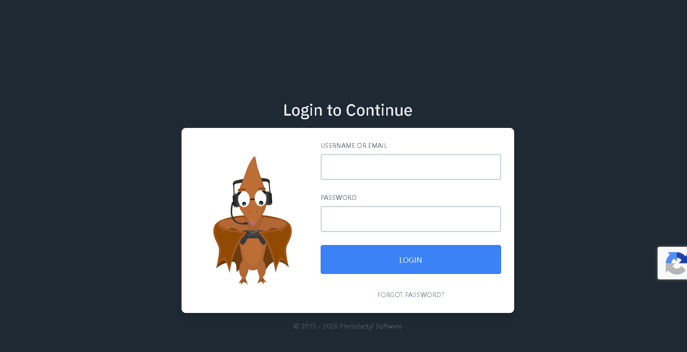
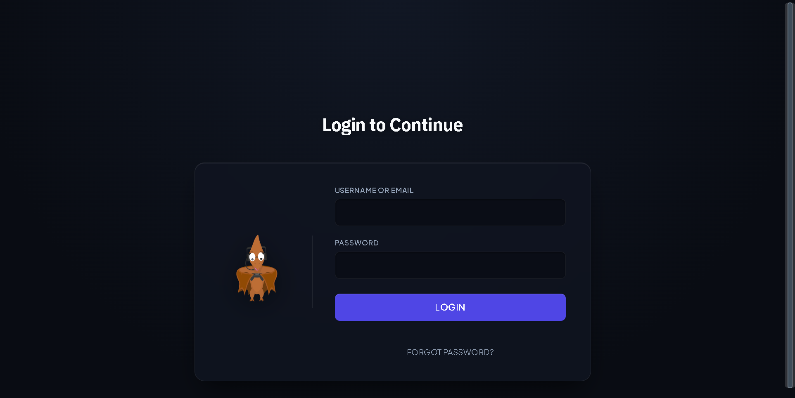

# 🌌 Kosmic Theme — Smooth Dark Theme for Pterodactyl

Developed by **xspidero**  
A high-performance, dark minimalist theme with smooth matte textures engineered for **Pterodactyl Panel (v1.12.x+)**. Features an automated installer, Cloudflare Edge licensing verification, and a Discord community hub.

---

## 📸 Preview

| Default Pterodactyl (Before) | Kosmic Theme (After) |
| :---: | :---: |
|  |  |

---

## ✨ Features

- 💎 **Smooth Dark Texture**: Deep obsidian slate surfaces with subtle frosted micro-borders and smooth inset shadows. Reduced gradients for a modern, tactile interface.
- 🚀 **Silenced reCAPTCHA**: Permanently eliminates intrusive floating captcha badges for a clean, uninterrupted authentication experience.
- 💬 **Discord Community Hub**: Direct navigation button connecting your players and staff to your community Discord server.
- ⚡ **Animated Server Telemetry**: Dynamic pulsing glow badges for live server statuses (Online, Starting, Offline).
- 💻 **Revamped Console**: Deep obsidian terminal styling with JetBrains Mono typography and clean solid action buttons (Start, Restart, Stop, Kill).
- 🛠️ **AdminLTE Dark Mode**: Complete dark interface overhaul for `/admin` matching the client-side theme.
- 🔒 **Cloudflare Edge Licensing**: Integrated cryptographic licensing authority verifying activations against our Cloudflare D1 cluster.

---

## 🔑 How to Get Your Free License

Kosmic is free to use for both personal and commercial game server hosting networks!

1. Join our official Discord server:  
   👉 **[https://discord.com/invite/hc9TUCsQpS](https://discord.com/invite/hc9TUCsQpS)**
2. Go to the **#claim-license** channel.
3. Claim your free community license key.

---

## 📦 Package Structure

This package is structured to standard Pterodactyl theme specifications:

```
Kosmic-Theme/
├── public/
│   └── themes/
│       └── kosmic/
│           ├── theme.css
│           ├── theme.js
│           └── admin-theme.css
├── resources/
│   └── views/
│       ├── templates/
│       │   └── wrapper.blade.php
│       └── layouts/
│           └── admin.blade.php
├── install.sh
├── uninstall.sh
├── LICENSE.md
├── LICENSE-KEY.txt
├── README.md
├── preview-before.png
└── preview-after.png
```

---

## 🚀 Installation

You can install Kosmic using either method below:

### Method 1: Public Quick Install (One-Line)

Run this single command on your Pterodactyl server (as root):

```bash
bash <(curl -s https://raw.githubusercontent.com/xspidero/kosmic-theme/main/install.sh)
```

### Method 2: Git Clone Installation

```bash
git clone https://github.com/xspidero/kosmic-theme.git
cd kosmic-theme
sudo chmod +x install.sh
sudo ./install.sh
```

During installation:
- The installer automatically detects your panel domain/hostname.
- Prompts for your Kosmic License Key (enter the key claimed from Discord).
- Handshakes cryptographically with the Cloudflare Edge API (`https://licensing.veloracloud.site/api/verify`).
- Preserves a safety backup of your original templates in `/var/www/pterodactyl/theme_backups/`.
- Deploys assets, configures permissions, and flushes Laravel template caches.

### Method 3: Manual Drag & Drop (BuiltByBit Package)

If you prefer manual file placement:

```bash
# Copy theme assets into panel root
cp -rf public/* /var/www/pterodactyl/public/
cp -rf resources/* /var/www/pterodactyl/resources/

# Flush Laravel template caches
cd /var/www/pterodactyl
php artisan view:clear
php artisan config:clear
php artisan cache:clear
```

---

## 🔄 Uninstallation & Rollback

To restore default Pterodactyl appearance at any time:

```bash
sudo chmod +x uninstall.sh
sudo ./uninstall.sh
```

The uninstaller automatically restores your untouched original template backups.

---

## 📄 License & Terms

Distributed under the **Kosmic Community License**. Author: **xspidero**. Free for personal and commercial game server hosting networks.  
Need help or custom modifications? Join our Discord: **[discord.com/invite/hc9TUCsQpS](https://discord.com/invite/hc9TUCsQpS)**
